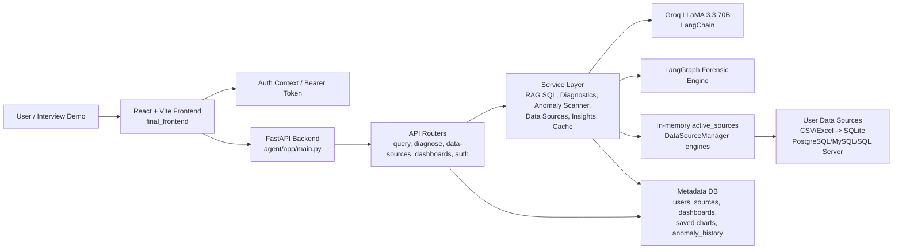
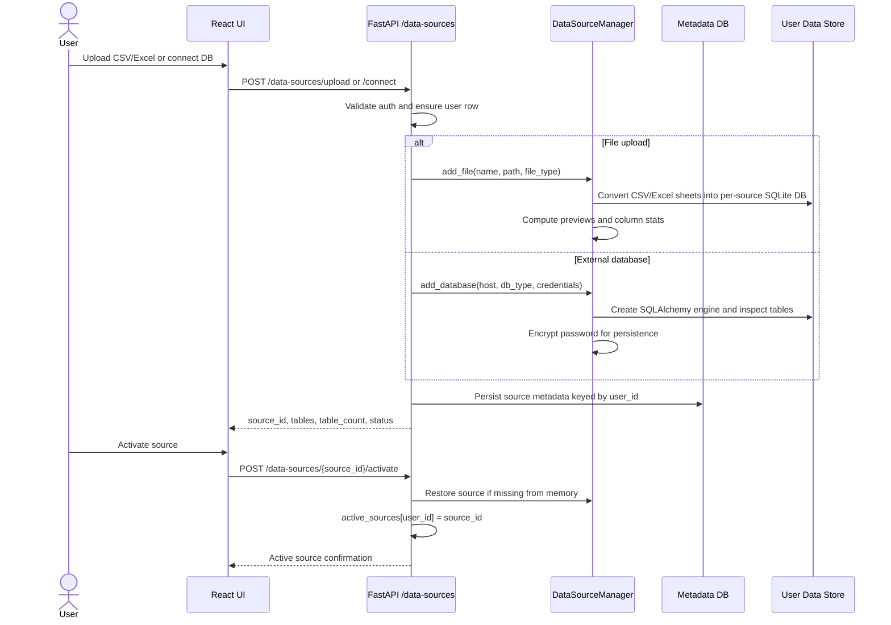
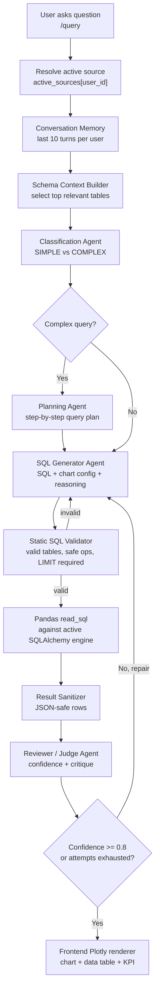
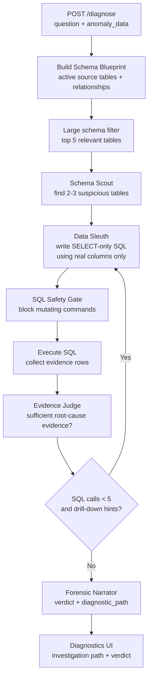
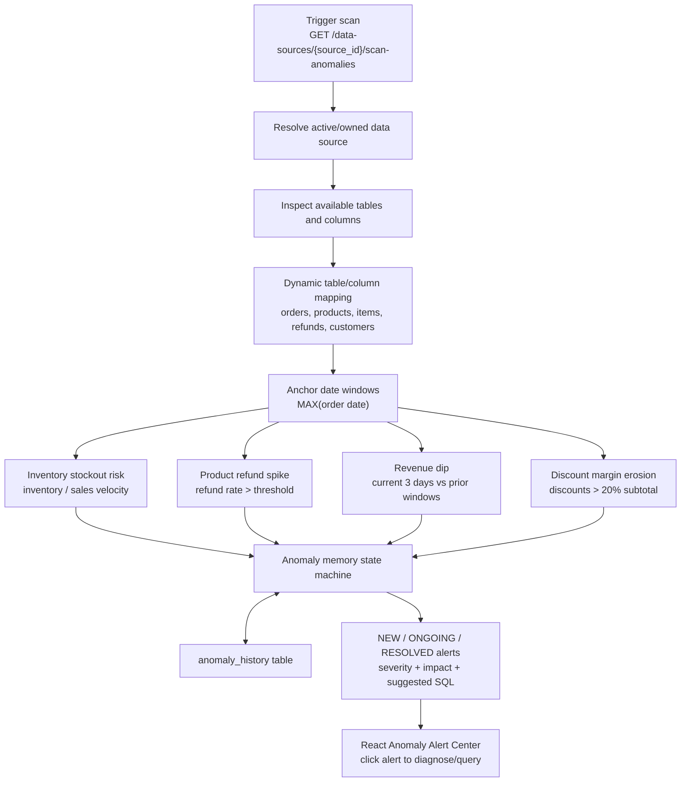
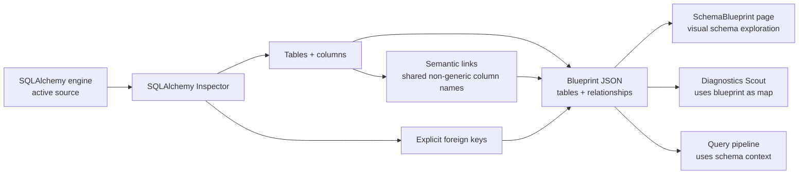
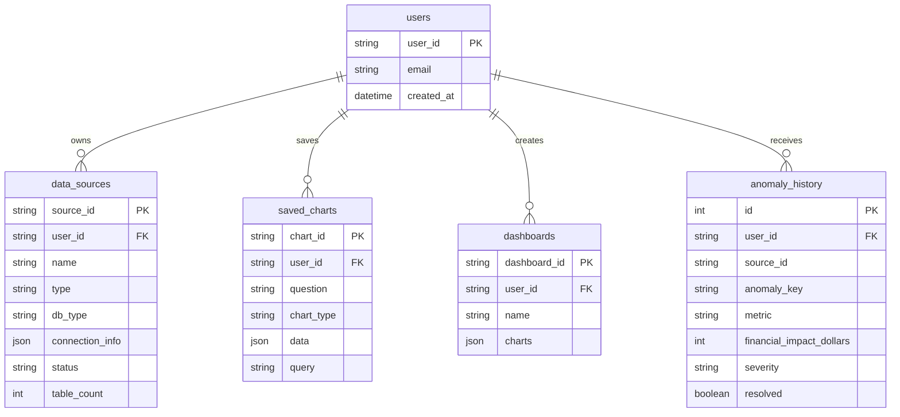
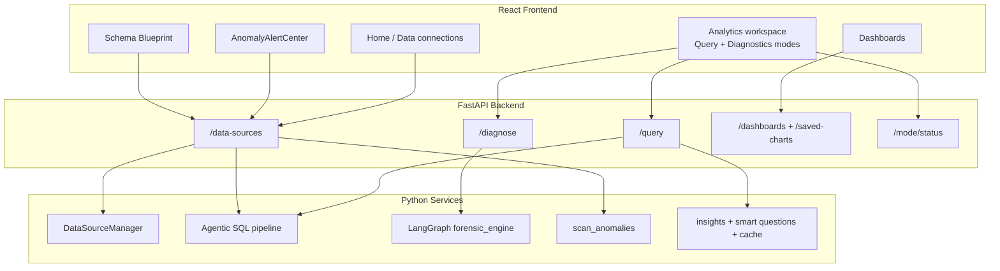

# Lumina AI / Data Analyst Agent - Interview Architecture

Use this as the quick architecture refresher before interview prep. It maps the resume bullets to the current repository implementation.

## 1. System Overview

**Main idea:** the frontend is a workspace for business users; FastAPI owns authentication, source selection, and orchestration; SQLAlchemy/Pandas run validated queries against the active source; Groq/LangChain provide reasoning; LangGraph drives deeper forensic investigations.

## 2. Data Source Lifecycle

**Interview talking points:**
- Every source is keyed by `user_id`; custom sources are ownership-checked before schema, query, scan, or delete.
- Files become isolated SQLite databases, which gives a uniform SQL execution path.
- External database credentials are encrypted before being stored in metadata.

## 3. Conversational SQL / Query & Charts Architecture

**What happens in code:**
- Route: `agent/app/routers/query.py`
- Main engine: `agent/app/services/rag_engine.py`
- Frontend caller: `final_frontend/src/pages/Analytics.tsx`
- Renderer: `final_frontend/src/components/ChatInterface.tsx`

**Good answer framing:** "I treated natural language analytics as a constrained agent pipeline, not a single LLM call. The system first narrows schema context, optionally plans, generates SQL and chart metadata, validates safety and schema correctness, executes through SQLAlchemy/Pandas, then has a reviewer agent decide whether to retry."

## 4. Deep Diagnostics / LangGraph Forensic Pipeline

**LangGraph nodes:**
- `schema_scout`: identifies suspicious upstream/related tables from the blueprint.
- `data_sleuth`: generates targeted SELECT queries, validates SQL safety, executes evidence-gathering queries.
- `evidence_judge`: decides if evidence is conclusive or asks for drill-down hints.
- `forensic_narrator`: converts evidence into a quantified root-cause report.

**Controls that matter in interviews:**
- Hard SQL budget: `MAX_SQL_CALLS = 5`.
- Column grounding: the Sleuth prompt receives exact table columns from the blueprint.
- Safety regex blocks mutating SQL like `DELETE`, `DROP`, `ALTER`, `UPDATE`, `INSERT`, `CREATE`, `TRUNCATE`, etc.
- Judge controls looping, so investigation stops when evidence is sufficient or the budget is exhausted.

## 5. Proactive Anomaly Detection Architecture

**What it detects now:**
- Inventory stockout risk based on average daily sales velocity.
- High product refund rate.
- Revenue drop using a double-window baseline.
- Discount-driven margin erosion.

**State model:**
- `NEW`: detected now and not previously unresolved.
- `ONGOING`: detected again while still unresolved.
- `RESOLVED`: existed before, but not detected in the current scan.

**Important repo note:** the current repository exposes anomaly scanning through an authenticated API endpoint and the frontend triggers it on mount/manual button click. I do not see Celery/Celery Beat in `requirements.txt` or the code. If asked about the resume bullet, be ready to clarify whether the scheduled Celery Beat version lived elsewhere, was planned, or that this repo contains the scheduler-ready scanner but not the scheduler worker.

## 6. Schema Blueprint / Relationship Discovery

**Why this is valuable:** uploaded CSV/Excel files often lack real foreign keys, so the system supplements explicit relationships with semantic links discovered from shared column names.

## 7. Persistence and Multi-Tenancy

**Security posture:**
- API routes depend on `get_current_user`.
- Data-source operations verify `source_id` ownership.
- Query SQL validation blocks dangerous operations and requires row limiting.
- Connection passwords are encrypted in metadata.

## 8. Request Flow Summary

## 9. Interview-Ready One-Liners

- **Overall architecture:** "Lumina AI is a multi-tenant FastAPI and React analytics platform where each user activates a data source, and all query, diagnosis, schema, dashboard, and anomaly workflows operate against that isolated active source."
- **SQL pipeline:** "The natural-language SQL path is agentic: memory, schema selection, classification, planning, SQL generation, static validation, execution, sanitization, and reviewer-based retry."
- **Forensics pipeline:** "The diagnostic path uses LangGraph as a controlled investigation loop: Scout picks likely tables, Sleuth gathers evidence with safe SQL, Judge decides whether to drill deeper, and Narrator produces the final root-cause verdict."
- **Anomaly pipeline:** "The anomaly scanner is deterministic and data-grounded: it maps messy ecommerce schemas to canonical concepts, runs targeted checks, persists anomaly history, and returns NEW/ONGOING/RESOLVED alerts with impact estimates and diagnostic queries."
- **Schema blueprint:** "The blueprint is the shared map used by both UI exploration and agents; it combines database inspection with semantic links for CSV/Excel sources that do not have real foreign keys."

## 10. Resume Alignment Notes

- **FastAPI:** implemented.
- **LangGraph:** implemented in `agent/app/services/diagnostics.py`.
- **PostgreSQL:** supported through `DataSourceManager.add_database`; metadata DB can also use `DATABASE_URL`.
- **React:** implemented in `final_frontend`.
- **Pinecone:** dependency/config/imports exist, but current `SchemaRAG` logs a vectorless LLM schema selector and bypasses cloud vector indexing.
- **Celery Beat:** not present in this checked-out repo. Current anomaly scanning is endpoint/UI-triggered.
- **Shopify CSV exports:** represented by demo seed data and `TEST_CSV` files; file uploads become SQLite-backed tables.
